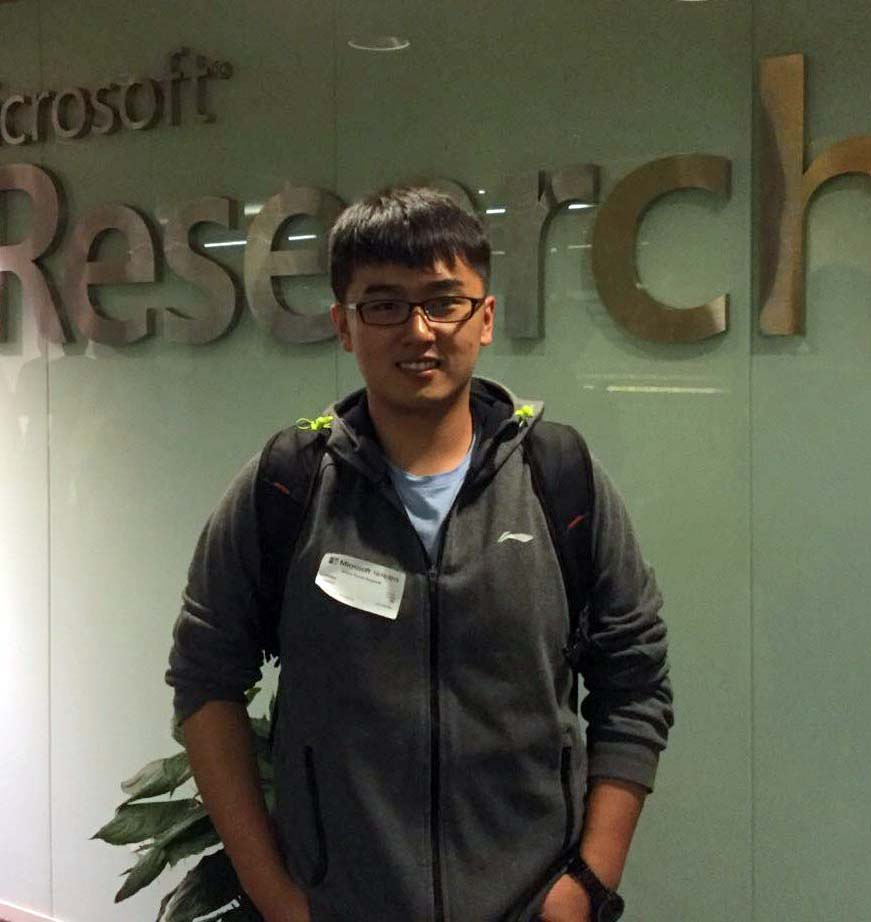

# About me

> MaJiangnan(Jonah)



### CONTACK

>* Email：jonahmoon@hotmail.com

>* GitHub：https://github.com/Jonahmoon

### EDUCATION：

>*	USTC  /  _Master of software engineering_
>*	SoochowUniversity / _Bachelor of computer science and technology /Bachelor of Business Administration_

## EXPERIENCE
>* Cambricon internship (R & D Engineer of deep learning framework):
  ```
  The development of hybrid precision training mechanism based on Cambricon chip;
  The development of pytorch framework based on Cambricon chips;
  The adaptation of deep learning model based on pytorch;
  The research and adaptation of high performance computing database operators based on Cambricon chips.
  ```

>* USTC：
   ```
   Application development and chip transplantation of style transfer model;
   Design and Implementation of Automatic Mixed Precision Training Mechanism Based on Machine Learning Unit.
   ```
  
## SKILLS
> Programming language: / C++ / C / Python / shell / Go 

> Deeplearning framework：/ pytorch / caffe

> DevOps: / Docker 

